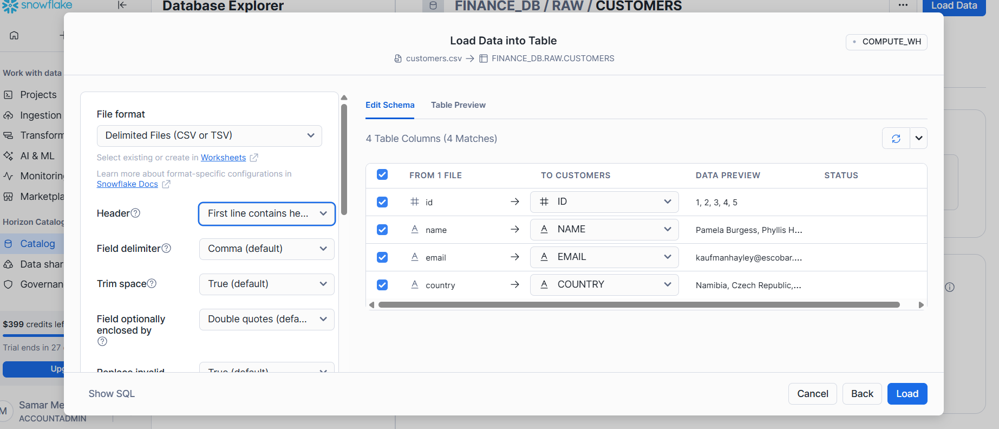
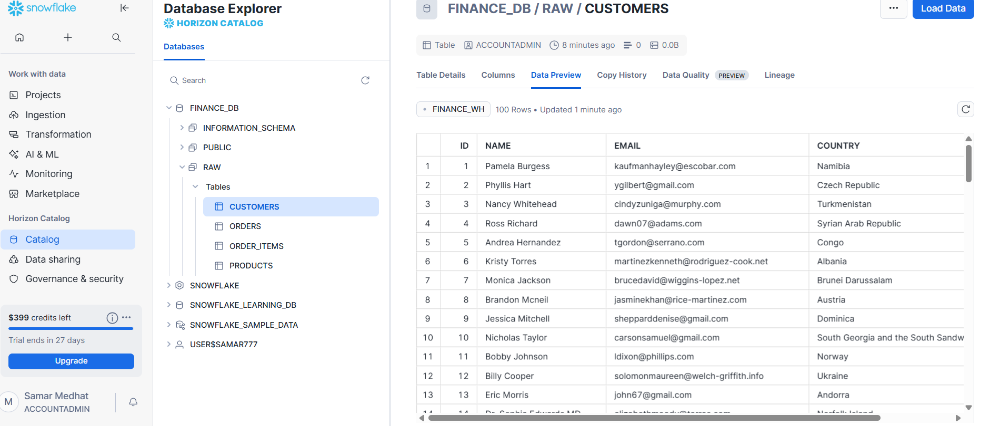
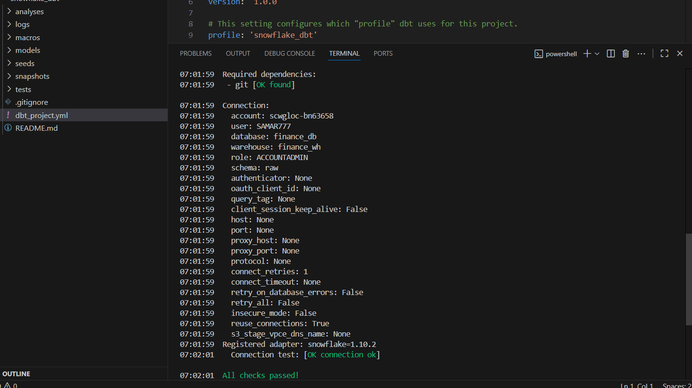
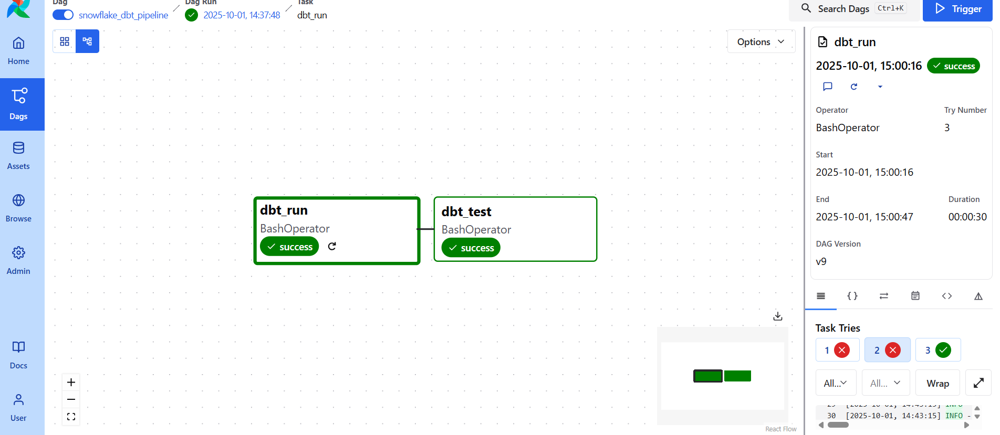
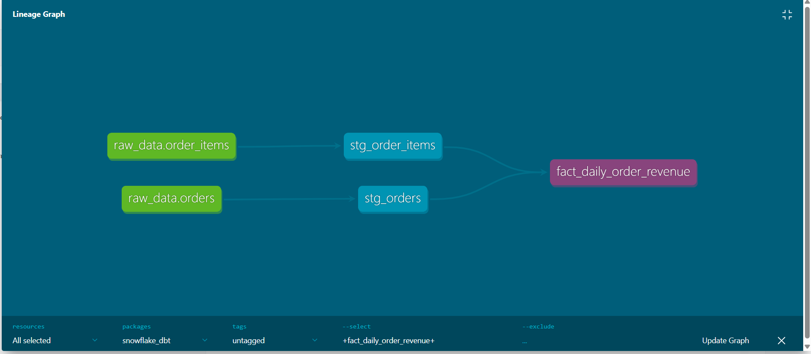
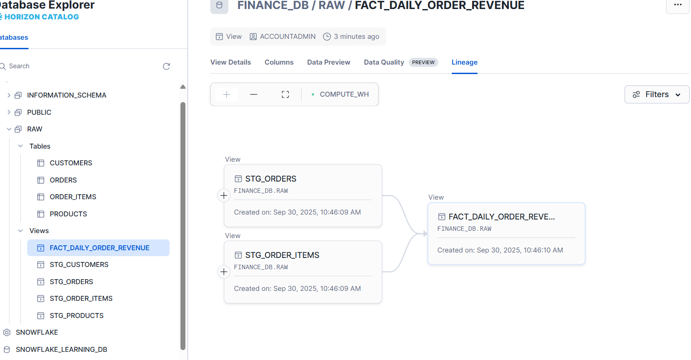

# End-to-End Data Pipeline with Snowflake, dbt, and Airflow

## 🎯 Project Overview
This project establishes an end-to-end ELT (Extract, Load, Transform) pipeline using Snowflake, dbt, and Apache Airflow.  
It ingests raw data into Snowflake, transforms it with dbt, and orchestrates workflows in Airflow to produce reliable, analytics-ready data marts.

---

## 🛠️ Tech Stack
| Component       | Technology         | Role |
|-----------------|-------------------|------|
| Data Warehouse  | Snowflake         | Stores raw, staging, and analytics data |
| Transformation  | dbt (Data Build Tool) | SQL + Jinja transformations, testing |
| Orchestration   | Apache Airflow    | Workflow scheduling and monitoring |
| Language        | SQL               | Data modeling and analytics |
| Containerization| Docker            | Consistent Airflow environment |
---

## 🌊 Data Flow
### 1. Ingestion (Snowflake)
Create Data Warehous `FINANCE_WH`
Create Database `FINANCE_WH`
Create Schema `RAW`
Create Tables `FINANCE_WH`,`FINANCE_WH`, 
Create Tables `Customers`, `Orders`, `Order_items`, `Products`
Raw source CSV files are loaded into `FINANCE_DB.RAW` schema.  




---

### 2. Transformation (dbt)
dbt transforms raw data into structured fact and dimension tables.  

Connection test:  



---

### 3. Orchestration (Airflow)
Airflow runs DAGs that execute dbt transformations.  



---

## 🔗 Data Lineage
Tracking how data flows from source to analytics models.  




## 🚀 Setup Instructions

### Prerequisites
- Docker & Docker Compose  
- Astro CLI installed  
- Snowflake credentials (User, Password, Account, Warehouse)  

### Steps

1. **Snowflake Setup**
   - Create warehouse `FINANCE_WH`, database `FINANCE_DB`, tables, load data

2. **Configure dbt**
   - Create `profiles.yml` with Snowflake credentials
   - Run `dbt debug` to test connection

3. **Launch Astro Airflow**
   ```bash
   astro dev start